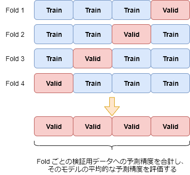

# Kaggle 入門

## GBDTによる「タイタニック号の生存予測」

タイタニック号の生存予測問題のようにテーブルデータの分析においては、安定して高い精度が期待できるGBDTをファーストチョイスとするのが主流である

### GBDTとは
- 参考: https://www.acceluniverse.com/blog/developers/2019/12/gbdt.html

GBDTは、以下のような特徴を有する

- 精度が比較的高い
- 欠損値を扱える
- 不要な特徴量があっても精度が落ちにくい
- 汎用性が高い


GBDTとは以下の手法を組み合わせたものである

- Gradient: 勾配降下法
    - 機械学習モデルの予測誤差を最小化するための手法
    - 参考: https://github.com/amenoyoya/ml-algorithm/blob/master/04_gradient.ipynb
- Boosting: アンサンブル手法の一種
    - アンサンブル手法とは多数決の原理を利用した学習手法である
        - 精度の低い学習器を複数組み合わせて精度を高くする手法
    - Boosting は、精度の低い学習器を順番に学習して組み合わせる手法である
- Decision Tree: 決定木
    - 決定木は木構造を用いて分類・回帰問題を解く手法で、段階的にデータを分析・分離することで目標値に関する推定結果を返す
    - 


### Kernel
ここでは GBDT 実装の一つである XGBoost モデルを採用する

XGBoost は単純な決定木の代わりに Random Forests（決定木を弱学習器とするアンサンブル学習手法）を採用することで、汎化能力を向上させた GDBT 実装である

```python
import numpy as np # NumPy: 数値計算ライブラリ
import pandas as pd # Pandas: データフレームライブラリ

# 訓練用データの読み込み
train = pd.read_csv("../input/titanic/train.csv")

# 検証用データの読み込み
test = pd.read_csv("../input/titanic/test.csv")

# --- 特徴量の作成 ---

from sklearn.preprocessing import LabelEncoder

# 訓練用データを特徴量と目的変数に分ける
train_x = train.drop(['Survived'], axis=1)
train_y = train['Survived']

# 検証用データに Survived カラム（目的変数）はないため、そのままで良い
test_x = test.copy()

# PassengerId, Name, Ticket, Cabin カラムを削除
## 特徴量として使えない or 使いづらいカラムを削除して特徴量選択
train_x = train_x.drop(['PassengerId', 'Name', 'Ticket', 'Cabin'], axis=1)
test_x = test_x.drop(['PassengerId', 'Name', 'Ticket', 'Cabin'], axis=1)

# 各カテゴリ変数に Label Encoding を適用
## LabelEncoder は与えられたラベルを最適な数値に自動的にフィッティングすることが可能
## => 手動で数値を割り振るより格段に楽
for c in ['Sex', 'Embarked']:
    # 欠損値は 'NA' とする
    ## 欠損値を補完しなくても使えるのがGBDTの良いところ
    x = train_x[c].fillna('NA')

    # 訓練用データに基づいてどう変換するか定める
    le = LabelEncoder()
    le.fit(x)
    
    # 訓練・検証用データを、最適化したLabelEncoderで数値データに変換
    train_x[c] = le.transform(train_x[c].fillna('NA'))
    test_x[c] = le.transform(test_x[c].fillna('NA'))

# --- XGBoostモデルで分類モデルの最適化 ---
from xgboost import XGBClassifier

model = XGBClassifier(n_estimators=20, random_state=71)
model.fit(train_x, train_y)

# 最適化したモデルで検証データの生存予測
pred = model.predict_proba(test_x)[:, 1]

# 予測結果を二値変換
pred_label = np.where(pred > 0.5, 1, 0)

# 提出用ファイルの作成
sub = pd.DataFrame({
    'PassengerId': test['PassengerId'],
    'Survived': pred_label
})
sub.to_csv("submission_xgb.csv", index=False)
```

### Result
- 予測精度: 77.99 %
- ランキング: 5924 位


このように、モデルをロジスティック回帰から GBDT（XGBoost）に変えるだけでも、性能は大きく向上することがある

各学習モデルの長所・短所を知り、どういったデータに対してはどのようなモデルが適しているのか、よく理解することが重要である

***

## モデルの評価

モデルを作成する主な目的は、未知のデータに対して予測を行うことであるため、未知のデータに対する予測性能を評価する方法が必要である

一般には、訓練用データを学習に用いるデータを評価用データに分け、評価用データへの予測精度を何らかの評価指標によるスコアで表すことによって評価する

この作業を**バリデーション**と呼ぶ

分析コンペでは様々な特徴量を作り、それが予測に有用かどうか、試行錯誤しながら良いモデルを求めていくことになる

このとき、正しくバリデーションが行えていないと、どの特徴量を採用するのが良いか進むべき方向が分からなくなってしまう

### クロスバリデーション
バリデーションを行う方法はいくつかあるが、よく使用されるのは**クロスバリデーション**と呼ばれる手法である

クロスバリデーションは、データを複数のブロックに分け、内1つを評価用データ、残りを学習用データとしてバリデーションを行う、という操作を、評価用データを入れ替えながら繰り返す方法である



### クロスバリデーションの実装
ScikitLearn にはクロスバリデーション用の便利なクラスとして `KFold` が用意されているため、今回はこれを使う

```python
# データの読み込み～特徴量エンジニアリングは省略

'''
クロスバリデーションによるモデル評価
'''
from sklearn.metrics import log_loss, accuracy_score
from sklearn.model_selection import KFold
from xgboost import XGBClassifier

# KFold を使って、クロスバリデーションを行うための fold 配列を作成する
## n_splits: 学習データの分割数（今回は4ブロックに分けて、内1ブロックを検証に用いるバリデーションを繰り返す）
## shuffle: True にすると学習データをシャッフルして、より均一な予測精度を得ることができる
## random_state: 学習データシャッフル時の乱数シードを指定
kf = KFold(n_splits=4, shuffle=True, random_state=71)

# 各 fold のスコアを保存するリスト
scores_accuracy = [] # accuracy: 正解率
scores_logloss = []  # logloss: 予測誤差

# XGBoostモデルで分類モデルの最適化
## fold ごとにモデルの訓練を行うため、関数化する
def train(train_x, train_y):
    model = XGBClassifier(n_estimators=20, random_state=71)
    model.fit(train_x, train_y)
    return model

# クロスバリデーションによるモデル評価
for train_idx, valid_idx in kf.split(train_x):
    # 学習データを学習データと評価データに分ける
    tr_x, va_x = train_x.iloc[train_idx], train_x.iloc[valid_idx]
    tr_y, va_y = train_y.iloc[train_idx], train_y.iloc[valid_idx]
    
    # モデル最適化
    model = train(tr_x, tr_y)
    
    # 評価データを用いて最適化モデルによる予測を実行
    va_pred = model.predict_proba(va_x)[:, 1]
    
    # モデル精度のスコア計算
    logloss = log_loss(va_y, va_pred) # 予測値の正解値からの誤差を計算
    accuracy = accuracy_score(va_y, va_pred > 0.5) # 予測値（確率）が 0.5 を超えている場合を 1（生存）として正解率を計算
    
    # fold ごとのスコアを保持
    scores_logloss.append(logloss)
    scores_accuracy.append(accuracy)

# スコアの平均値を求めることでモデルの制度を評価する
logloss = np.mean(scores_logloss)
accuracy = np.mean(scores_accuracy)
print(f'logloss: {logloss:.4f}, accuracy: {accuracy:.4f}')
```

```bash
# OUTPUT
logloss: 0.4270, accuracy: 0.8148
```

結果として、正解率は 81.48 % となった

課題の未知データに対する精度が 77.99 % だったことを考えると、やや高い精度になっているが、これは一部の学習データと評価データが重複していることにより微妙な過学習が起こってしまうためである

そのため、クロスバリデーションによる評価は、基本的に実際の予測精度よりも良く評価されがちである

クロスバリデーションによる評価を実際の予測精度に近づけるためには、学習データを大量に揃えることが必要になる

とは言え、今回くらいの評価誤差であれば、許容範囲と言っても良い（77.99 % と 81.48 % 程度の差で、大まかにいえば 8割程度の予測精度を持つと評価することが可能であるため）

***

## モデルのチューニング

機械学習モデルには、学習前に手動で指定し、学習の方法や速度、複雑性などを定めるパラメータとして**ハイパーパラメータ**がある

このハイパーパラメータが最適でない場合は、モデルのポテンシャルを十分に発揮できないことがあるため、チューニングを行う必要がある

（参考: https://github.com/amenoyoya/ml-algorithm/blob/master/03_loss_function.ipynb）

### グリッドサーチによるチューニング
チューニング対象のハイパーパラメータのすべての組み合わせについて探索を行い、最もスコアが高いものを採用する方法を**グリッドサーチ**と呼ぶ（総当たり手法）

XGBoostには `max_depth`, `min_child_weight` というハイパーパラメータがあるため、グリッドサーチを用いてこれらのパラメータを最適化してみる

#### 実装
```python
# データ読み込み～特徴量エンジニアリングは省略

'''
グリッドサーチによるハイパーパラメータのチューニング
'''
from sklearn.metrics import log_loss, accuracy_score
from sklearn.model_selection import KFold
from xgboost import XGBClassifier
import itertools

# XGBoostモデルで分類モデルの最適化
def train(train_x, train_y, max_depth, min_child_weight):
    model = XGBClassifier(
        n_estimators=20, random_state=71,
        max_depth=max_depth, min_child_weight=min_child_weight
    )
    model.fit(train_x, train_y)
    return model

# クロスバリデーション
def cross_validate(train_x, train_y, max_depth, min_child_weight):
    scores_logloss = []
    scores_accuracy = []
    kf = KFold(n_splits=4, shuffle=True, random_state=123456)
    for train_idx, valid_idx in kf.split(train_x):
        # 学習データを学習データと評価データに分ける
        tr_x, va_x = train_x.iloc[train_idx], train_x.iloc[valid_idx]
        tr_y, va_y = train_y.iloc[train_idx], train_y.iloc[valid_idx]
        # モデル最適化
        model = train(tr_x, tr_y, max_depth, min_child_weight)
        # モデル精度のスコア計算
        va_pred = model.predict_proba(va_x)[:, 1]
        logloss = log_loss(va_y, va_pred) # 予測値の正解値からの誤差を計算
        accuracy = accuracy_score(va_y, va_pred > 0.5) # 予測値（確率）が 0.5 を超えている場合を 1（生存）として正解率を計算
        # fold ごとのスコアを保持
        scores_logloss.append(logloss)
        scores_accuracy.append(accuracy)
    return scores_logloss, scores_accuracy

# チューニング候補とするパラメータを準備
param_space = {
    'max_depth': [3, 5, 7],
    'min_child_weight': [1.0, 2.0, 4.0]
}

# パラメータの組み合わせを作成
param_combinations = itertools.product(param_space['max_depth'], param_space['min_child_weight'])

# パラメータの組み合わせとそのスコアを保持するリスト
params = []
scores = []

# 各パラメータの組み合わせごとにクロスバリデーションによる評価を実行
for max_depth, min_child_weight in param_combinations:
    scores_logloss, scores_accuracy = cross_validate(train_x, train_y, max_depth, min_child_weight)
    # 各foldのスコア（logloss）を平均し、それを保持する
    score = np.mean(scores_logloss)
    params.append((max_depth, min_child_weight))
    scores.append(score)

# 最もスコアが良いものを最適パラメータとする
best_idx = np.argsort(scores)[0]
best_param = params[best_idx]
print(f'max_depth: {best_param[0]}, min_child_weight: {best_param[1]}')
```

結果、`max_depth: 7, min_child_weight: 2.0` が、ハイパーパラメータの最適な組み合わせであることが分かった

そのため、このハイパーパラメータの組み合わせで訓練したモデルを提出することにする

```python
# モデル最適化: ハイパーパラメータの組み合わせ = (7, 2.0)
model = train(train_x, train_y, 7, 2.0)

# 最適化したモデルで検証データの生存予測
pred = model.predict_proba(test_x)[:, 1]

# 予測結果を二値変換
pred_label = np.where(pred > 0.5, 1, 0)

# 提出用ファイルの作成
sub = pd.DataFrame({
    'PassengerId': test['PassengerId'],
    'Survived': pred_label
})
sub.to_csv("submission_xgb.csv", index=False)
```

なお、このモデルでは、精度 76.076 % となり、若干精度が下がってしまった

従って、最適パラメータは他にあることになる

グリッドサーチでは、自分でパラメータの候補を選定しなければならないため、結局は地道に探していかなければ最適パラメータを求めることはできないということである
