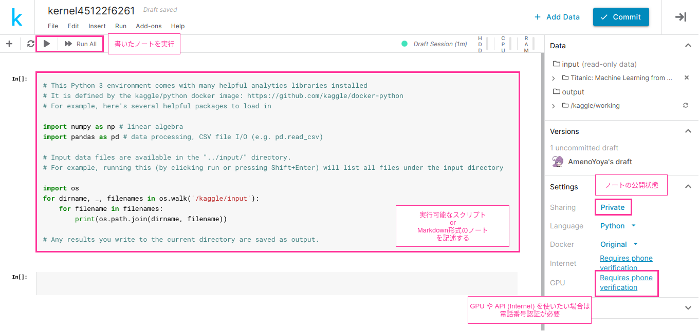
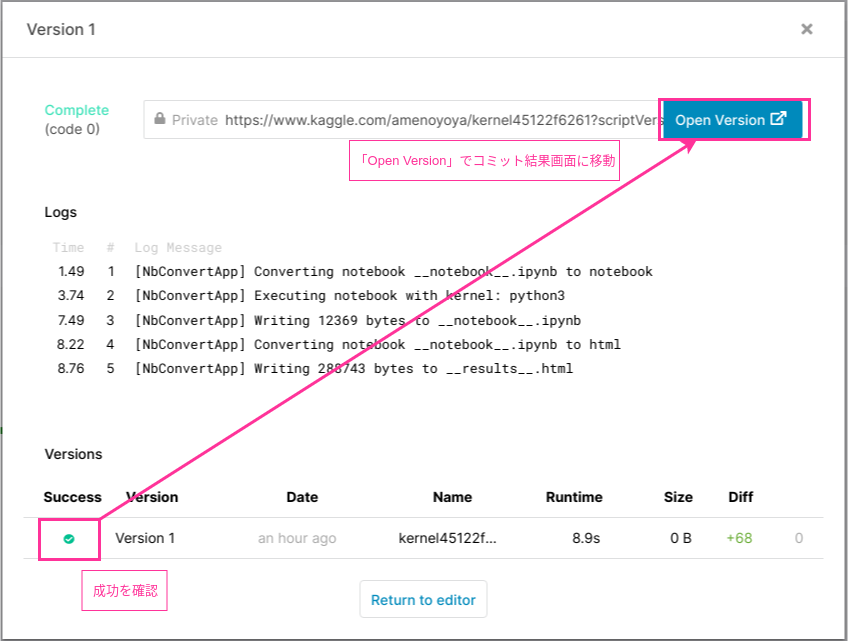

# Kaggle 入門

## Kaggle とは

- 機械学習・データサイエンスに携わっている人間が世界中から集まっているコミニティー
- 企業や政府などの組織と、データ分析のプロであるデータサイエンティスト/機械学習エンジニアを繋げるプラットフォームとなっている
- 単純なマッチングではなく、「Competetion（コンペ）」がKaggleの目玉の一つ
    - Competition（コンペ）は、企業や政府がコンペ形式（競争形式）で課題を提示し、賞金と引き換えに最も制度の高い分析モデルを買い取る仕組み
    - 開催されるコンペは様々で、アメリカ国土安全保障省による空港のセキュリティースクリーニングの認識アルゴリズムの競争や、日本のメルカリによる販売者への自動価格提案アルゴリズムなどが開催されている
    - Kagglerは無料でこれらのコンペに参加が可能で、企業から提供されているトレーニング用のデータセット（またそれに付随する様々なデータ）を利用して、モデルの訓練およびテストセットの評価ができる
- 初心者向けの一つの機能として「Kernels（カーネル）」というものもある
    - カーネルでは、各データセットに対して他のユーザーが構築した予測モデルのコードや説明が公開されている
    - 初心者にも優しく説明がされているカーネルも多数あり、カーネルを眺めているだけでも勉強になることが多い
    - カーネルはブラウザ上で実行可能な機械学習実行環境で、一般的なノートパソコン以上の性能の環境を無料で自由に使うことが可能
- 「Discussion（ディスカッション）」では、世界中のデータサイエンティスト・機械学習実装者とのコミュニケーションも可能

***

## Kernel を使ってみる

### Kernel を新規作成する
Kernel を新規作成する場合は、マイページの「Kernel」タブから「Create New Notebook」を選ぶ


2020年1月時点で、Kernel として使用可能な言語は **Python** と **R** である

また、**Notebook（Jupyter Notebook）形式** か **Script形式** を選択することができる


基本的には、インタラクティブに実行できる Notebook形式 がオススメである

***

## Kaggle コンペへの参加

- 参考:
    - https://qiita.com/upura/items/3c10ff6fed4e7c3d70f0
    - https://qiita.com/suzumi/items/8ce18bc90c942663d1e6

### タイタニック号の生存予測コンペ
[タイタニック号の生存予測](https://www.kaggle.com/c/titanic) は Kaggle におけるチュートリアル的なコンペである

まずは、このコンペに参加してみる

コンペページの「Join Competition」を押すと、ルールに同意するかどうかのダイアログが出てくるため「I Understand and Accept」をクリックする


コンペに参加できたら、「Notebook」タブから「New Notebook」を押す

すると、コンペ用の Kernel を作成できるため、使用言語と形式を選択する（今回は **Python** / **Notebook形式** とした）


Notebook形式の Kernel を作ると以下のような画面になるはずである



右側の「Settings」メニューから、Kernel の公開状態や使用言語、GPUなどを変更することができる

なお、GPUを使いたい場合は電話番号認証が必要である

### 電話番号認証
GPUが使えないと遅すぎて使い物にならないため、電話番号認証をしておく

「Requires phone validation」をクリックし、電話番号を入力する


SMSでコード（数字）が送られてくるため、それを入力して「Verify」する


***

## タイタニックの生存予測

実際に Kernel を用いて機械学習を行う

とりあえずは、u++ さんのコード（ロジスティック回帰による分類最適化）をそのまま実行してみる

```python
import numpy as np # NumPy: 数値計算ライブラリ
import pandas as pd # Pandas: データフレームライブラリ

# 訓練用データの読み込み
train = pd.read_csv("../input/titanic/train.csv")

# 検証用データの読み込み
test = pd.read_csv("../input/titanic/test.csv")

# --- 特徴量エンジニアリング ---

# 訓練・検証用データを合成
data = pd.concat([train, test], sort=False)

# Sex: male => 0, female => 1
data['Sex'].replace(['male','female'], [0, 1], inplace=True)

# Embarked: 欠損値を S で埋め、S => 0, C => 1, Q => 2 に変換 
data['Embarked'].fillna(('S'), inplace=True)
data['Embarked'] = data['Embarked'].map( {'S': 0, 'C': 1, 'Q': 2} ).astype(int)

# Fare: 欠損データを平均値で埋める
data['Fare'].fillna(np.mean(data['Fare']), inplace=True)

# Age: 欠損データを (平均値±標準偏差) で埋める
age_avg = data['Age'].mean()
age_std = data['Age'].std()
data['Age'].fillna(np.random.randint(age_avg - age_std, age_avg + age_std), inplace=True)

# 今回、特徴量として Name, PassengerId, SibSp, Parch, Ticket, Cabin は使わないことにする
delete_columns = ['Name', 'PassengerId', 'SibSp', 'Parch', 'Ticket', 'Cabin']
data.drop(delete_columns, axis=1, inplace=True)

train_data = data[:len(train)]
test_data = data[len(train):]

# 教師データ: 訓練用データの `Survived` (生存したか否か) カラム
y_train = train_data['Survived']

# 特徴量データ: 訓練用データから `Surviced` カラムを抜いたもの
X_train = train_data.drop('Survived', axis=1)
X_test = test_data.drop('Survived', axis=1)

# --- ロジスティック回帰で分類ソルバ最適化 ---
from sklearn.linear_model import LogisticRegression

clf = LogisticRegression(penalty='l2', solver="sag", random_state=0)
clf.fit(X_train, y_train)

# 最適化したソルバで検証データの生存予測
y_pred = clf.predict(X_test)

# コンペ提出用データの読み込み
gender_submission = pd.read_csv("../input/titanic/gender_submission.csv")
sub = gender_submission

# 最適化ソルバーの予測結果を `Survived` カラムにマッピング
sub['Survived'] = list(map(int, y_pred))

# 課題提出
sub.to_csv("submission.csv", index=False)
```

実行して問題なく動くようであれば、右上の「COMMIT」ボタンを押して、コミットする（コードを実際のデータに対して実行し、ソースコードと結果を保存する）

少し待って、無事コミットが成功したらひとまずOK



### 課題の提出
コミット結果ダイアログの「Open Version」をクリックすると、実行結果を確認することができる


「Output」メニューから実行結果を確認し、問題なさそうであれば「Submit to Competition」で提出する

すると、自分の名前がコンペのランキングに載るはずである


結果は、予測精度 66.985 % でかなり下の方のランキングであった

***

## データ分析の流れ

データ分析は基本的に以下のような流れで行われる

1. データの読み込み
2. 特徴量エンジニアリング
3. モデルの訓練（学習）
4. モデルの評価

なお、機械学習におけるモデルとは、コンピュータが分かる形の入力値を受け取り、何らかの評価・判定をして出力値を返すもののことをいう（狭義的には「関数」であると考えてもよいかもしれない）

このモデルは、複数のパラメータを保持しており、それらパラメータの値によって出力値が変わってくる

機械学習の本質とは、モデルのパラメータを調整しながら、出力値と答えの誤差を減らすように最適化していくことと言ってもよい

### データの読み込み
データには、モデルの学習に使うための学習用データと、モデルの性能を検証するための検証用データが必要になる

機械学習において、高性能なモデルを構築するためには大量のデータが必要になるため、データを集めるのが最初の難関とも言われる

また、単純に大量のデータだけあっても、そのデータが正確でなかったり、求める予測目的と関係のないデータであったりしても意味がないため、データの質も重要になってくる

そのため、**データクレンジング**作業も、面倒だが重要な作業である

データクレンジングとは、データの中から、重複や誤記、表記揺れ等を探し出し、削除や修正、正規化などを行い、データの品質を高めることを指す

#### 実装: データ読み込み
今回の場合、データ読み込み工程にあたるのは以下のコードである

```python
import numpy as np # NumPy: 数値計算ライブラリ
import pandas as pd # Pandas: データフレームライブラリ

# 訓練用データの読み込み
train = pd.read_csv("../input/titanic/train.csv")

# 検証用データの読み込み
test = pd.read_csv("../input/titanic/test.csv")
```

最初の2行で NumPy と Pandas というライブラリを読み込んでいる

NumPy は Python 用の数値計算ライブラリであり、ベクトル計算や微分計算など、機械学習に有用な関数やクラスが詰め込まれている

実は数値計算が苦手な言語である Python が、機械学習分野においてこれほどに流行したのは、NumPy という秀逸なライブラリがあったということも大きい

Pandas は行と列からなるテーブルデータを扱うのに便利なライブラリである

今回のデータはテーブルデータであるため、Pandas を使って CSV ファイルから読み込みを行っている

---

### 特徴量エンジニアリング
特徴量とは、学習の入力に使う測定可能な特性のことである

教師あり学習の場合、目的変数（予測したい目的のデータ）を説明する変数という意味で**説明変数**とも呼ばれる

特徴量エンジニアリングとは、学習の入力として使いやすい形に特徴量データを加工する行程を指す

この工程において、データの内容を確認したり、データをグラフ化したりするのに、Notebook形式のKernelが使いやすいのである

例えば、Pandasライブラリでデータを読み込んだ場合 `<DataFrame>.head()` メソッドで、以下のようにデータカラム名と頭数行分のデータを確認することができる


このようにインタラクティブにデータを確認しながら、以下のような流れで特徴量エンジニアリングを行っていく

1. 特徴量選択
2. 数値エンコーディング
3. 欠損値の補完

#### 特徴量選択
今回の「タイタニック号の生存予測」問題の場合、訓練用データには以下のようなデータが含まれている

- PassengerId: 乗客ID（データIDとして 1～891 の番号が振られている）
- Survived: 生存したかどうか（死亡: 0, 生存: 1）
- Pclass: チケットクラス（1: ファーストクラス, 2: セカンドクラス, 3: サードクラス）
- Name: 乗客の名前
- Sex: 性別（"male" or "female"）
- Age: 年齢
- SibSp: 兄弟、配偶者の数
- Parch: 両親、子供の数
- Ticket: チケット番号
- Fare: 乗船料金
- Cabin: 部屋番号
- Embarked: 乗船港（"Cherbourg" | "Queenstown" | "Southampton"）

上記のうち、Survived（生存したかどうか）が予測したい変数（目的変数）である

この目的変数に影響を与えそうな変数を選択することを**特徴量変数**と呼ぶ

例えば、乗客IDは明らかに、生存するかしないかには関係しないため除外する、という具合である

各変数を特徴量として採用するかどうかは、仮説に基づいて選択することになる

#### 数値エンコーディング
基本的に機械学習モデルは、数値データを取り扱う（数値データでないと最適化を行うことができない）

そのため、文字列として表記されているデータなどは、何らかの形で数値表現に変換する必要がある

これを**数値エンコーディング**と呼び、この工程も内容によっては非常に骨が折れる

例えば、「男性」「女性」という性別データは単純に「0」「1」に対応させればよいが、自然言語分析などになってくると、数値化させるのはなかなか大変である

#### 欠損値の補完
現実のデータでは、すべてのデータが完全にそろっていることはまれであり、値が欠損している部分が存在することの方が多い

この欠損データを**欠損値**と呼び、これをどのように補完するかがモデルの学習効率に影響を与えることも少なくない

単純にゼロ埋めするのか、そろっている値の平均値で埋めるのか、など、試行錯誤する必要がある

#### 実装: 特徴量エンジニアリング
今回、特徴量エンジニアリングの工程にあたるのは以下のコードである

データをどのように加工しているかはコメントの通りであるが、実際に Kernel 上でデータの中身を確認しながら動かすと、より分かりやすいと考える

```python
# 訓練・検証用データを合成
data = pd.concat([train, test], sort=False)

# Sex: male => 0, female => 1
data['Sex'].replace(['male','female'], [0, 1], inplace=True)

# Embarked: 欠損値を S で埋め、S => 0, C => 1, Q => 2 に変換 
data['Embarked'].fillna(('S'), inplace=True)
data['Embarked'] = data['Embarked'].map( {'S': 0, 'C': 1, 'Q': 2} ).astype(int)

# Fare: 欠損データを平均値で埋める
data['Fare'].fillna(np.mean(data['Fare']), inplace=True)

# Age: 欠損データを (平均値±標準偏差) で埋める
age_avg = data['Age'].mean()
age_std = data['Age'].std()
data['Age'].fillna(np.random.randint(age_avg - age_std, age_avg + age_std), inplace=True)

# 今回、特徴量として Name, PassengerId, SibSp, Parch, Ticket, Cabin は使わないことにする
delete_columns = ['Name', 'PassengerId', 'SibSp', 'Parch', 'Ticket', 'Cabin']
data.drop(delete_columns, axis=1, inplace=True)

train_data = data[:len(train)]
test_data = data[len(train):]

# 教師データ: 訓練用データの `Survived` (生存したか否か) カラム
y_train = train_data['Survived']

# 特徴量データ: 訓練用データから `Surviced` カラムを抜いたもの
X_train = train_data.drop('Survived', axis=1)
X_test = test_data.drop('Survived', axis=1)
```

なお、最初に訓練用データと検証用データを合成しているのは、データ加工をまとめて行いたかったからである

---

### モデルの訓練（学習）
この工程が、いわゆる「機械学習」の工程である

何らかのパラメータを持ち、特定の入力値を演算加工して出力値を返すモデルを構築するところから、この工程は始まる

モデルを構築したら、データを入力し、出力値が求める値とどの程度の誤差があるか計算する

誤差を計算したら、パラメータを調整し再度計算しなおす、という操作を繰り返していき、誤差が最小になるように訓練することになる

この操作では、**誤差逆伝搬法**という計算技術が使われることが多い

- 参考: [05_back_propagation.ipynb](../05_back_propagation.ipynb)

#### 実装: モデルの訓練
今回は、ロジスティック回帰モデルを採用した

ロジスティック回帰は以下の数式で表され、「回帰」という名前にも関わらず、回帰問題ではなく分類問題で使用されるアルゴリズムである

$$
    y = \frac{1}{1 + \exp[-(b_0 + \sum^i (b_i \times x_i))]}
$$

なお、$y$ が目的変数、$x_i$ が各説明変数（特徴量）、$b_i$ が偏回帰係数である

ロジスティック回帰モデルの学習では、この偏回帰係数というパラメータを最適化することになる

```python
from sklearn.linear_model import LogisticRegression

clf = LogisticRegression(penalty='l2', solver="sag", random_state=0)
clf.fit(X_train, y_train)
```

ScikitLearn というライブラリを使うと `fit` メソッド一発でモデルの最適化が可能なため非常に便利である

---

### モデルの評価
モデルの訓練（学習）が完了したら、検証用データを用いて、未知のデータに対する予測精度を評価する

この精度が良くなければ、モデルの再構築を行う、特徴量を選択しなおす、ハイパーパラメータを調整する等の試行錯誤を行うことになる

とにかく機械学習とは、試行錯誤の連続であり、非常に泥臭い作業であると言える

#### 実装: モデルの評価
今回は、学習済みのモデルによる予測結果を Kaggle コンペに提出するところまで実装している

提出は基本的には、コンペ指定のフォーマットでファイルを作成するだけで良い

```python
# 最適化したソルバで検証データの生存予測
y_pred = clf.predict(X_test)

# コンペ提出用データの読み込み
gender_submission = pd.read_csv('../input/titanic/gender_submission.csv')
sub = gender_submission

# 最適化ソルバーの予測結果を `Survived` カラムにマッピング
sub['Survived'] = list(map(int, y_pred))

# 課題提出: ファイル名は任意でよい
sub.to_csv('submission.csv', index=False)
```

今回は、コンペ提出様式（`gender_submission.csv`）を読み込んで使っているが、提出データ様式をちゃんと理解できているのであれば、どのようにデータを生成しても構わない
